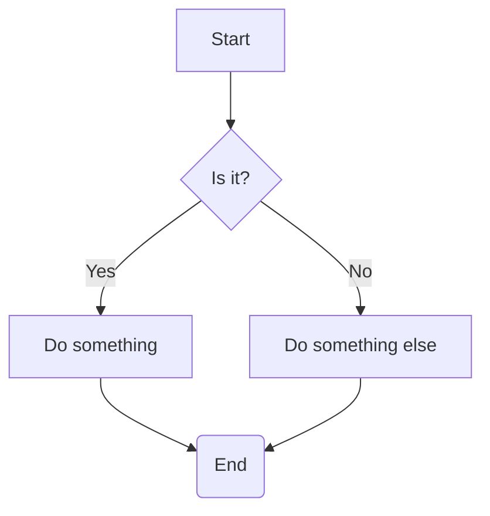
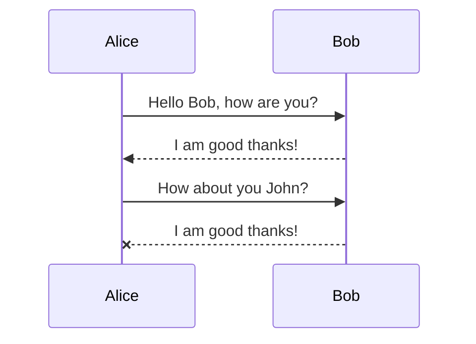
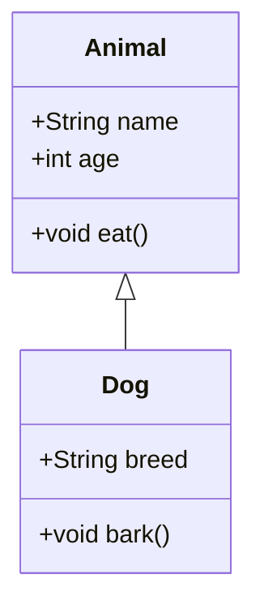
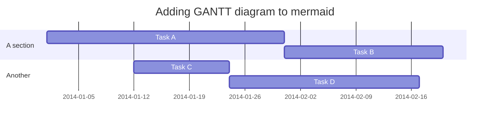
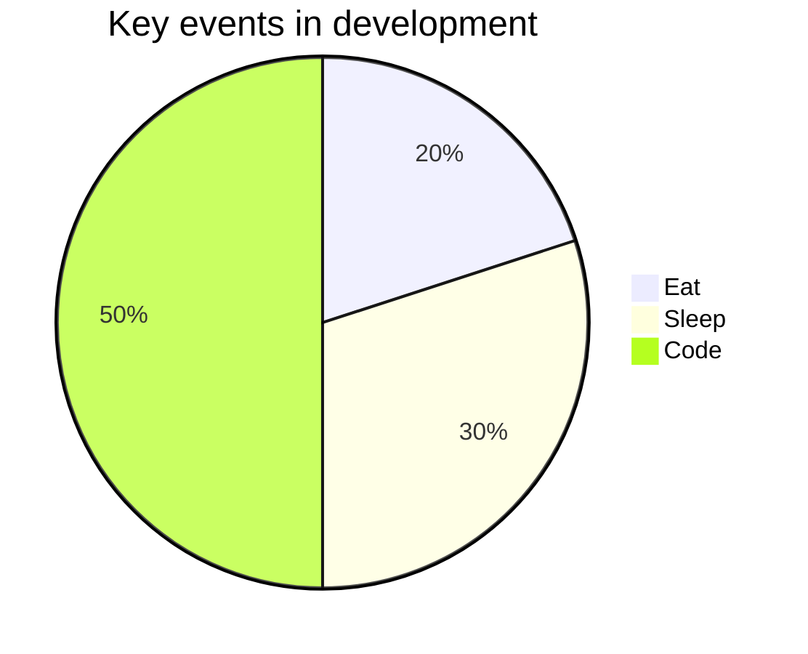
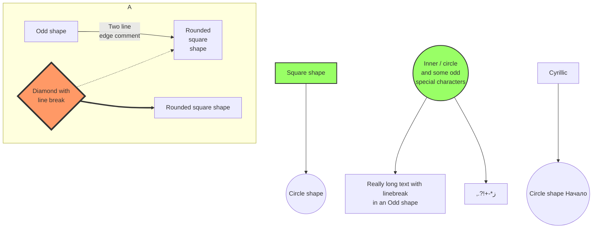
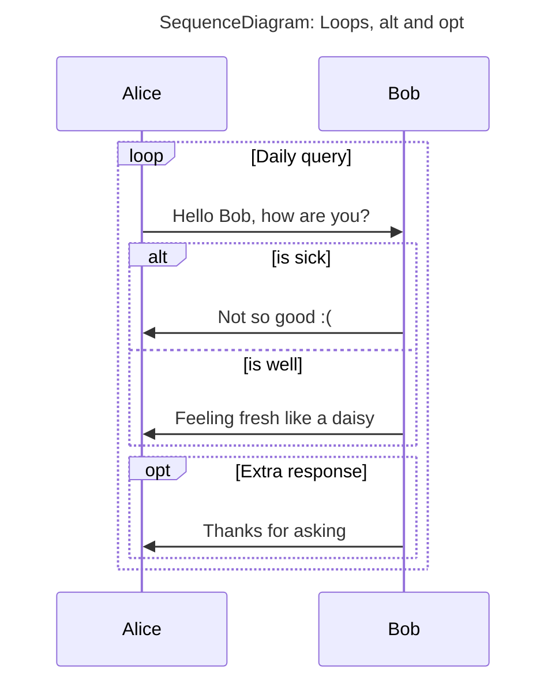
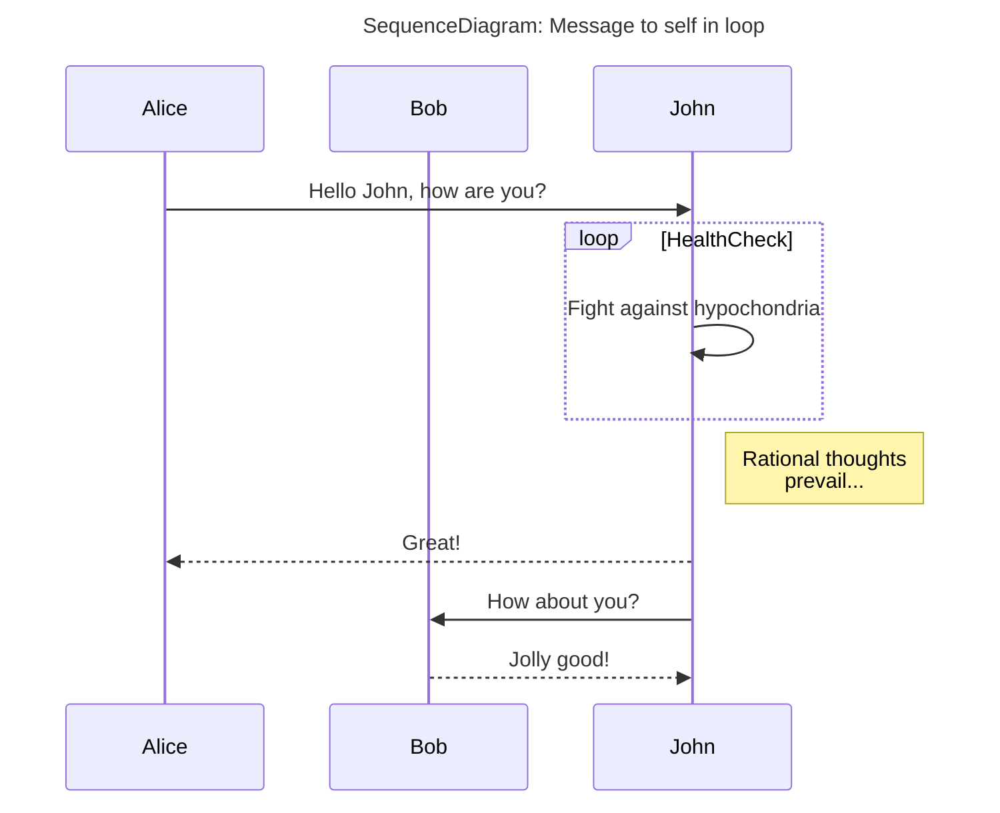
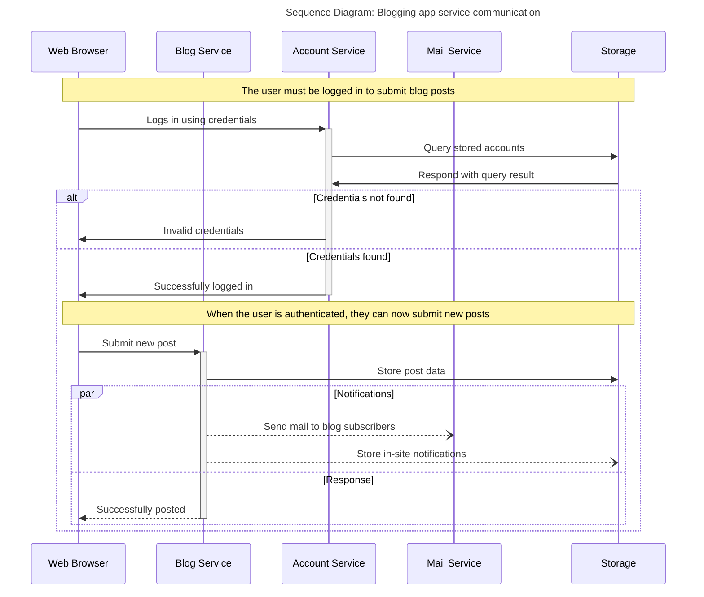
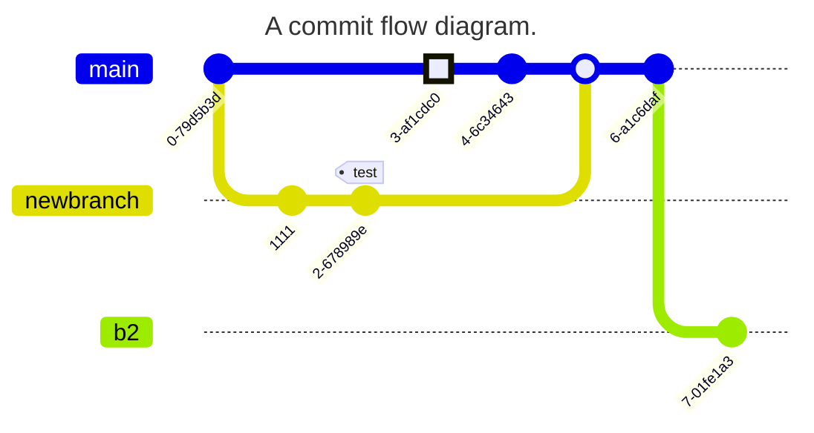

# Test different VSCode markdow preview items

```mermaid
graph TD
    A[Start] --> B{Is it?};
    B -- Yes --> C[Do something];
    C --> D(End);
    B -- No --> E[Do something else];
    E --> D;
```

```mermaid
sequenceDiagram
    Alice->>Bob: Hello Bob, how are you?
    Bob-->>Alice: I am good thanks!
    Alice->>Bob: How about you John?
    Bob--x Alice: I am good thanks!
```

```mermaid
classDiagram
    class Animal{
        +String name
        +int age
        +void eat()
    }
    class Dog{
        +String breed
        +void bark()
    }
    Animal <|-- Dog
```

```mermaid
gantt
    dateFormat  YYYY-MM-DD
    title Adding GANTT diagram to mermaid
    section A section
    Task A           :a1, 2014-01-01, 30d
    Task B           :after a1, 20d
    section Another
    Task C           :2014-01-12, 12d
    Task D           :24d
```

```mermaid
pie
    title Key events in development
    "Eat" : 20
    "Sleep" : 30
    "Code" : 50
```

#### Larger flowchart with some styling 

```mermaid
graph TB
    sq[Square shape] --> ci((Circle shape))

    subgraph A
        od[Odd shape]-- Two line<br/>edge comment --> ro
        di{Diamond with <br/> line break} -.-> ro[Rounded<br>square<br>shape]
        di==>ro2[Rounded square shape]
    end

    %% Notice that no text in shape are added here instead that is appended further down
    e --> od3[Really long text with linebreak<br>in an Odd shape]

    %% Comments after double percent signs
    e((Inner / circle<br>and some odd <br>special characters)) --> f[,.?!+-*ز]

    cyr[Cyrillic]-->cyr2((Circle shape Начало))

    classDef green fill:#9f6,stroke:#333,stroke-width:2px;
    classDef orange fill:#f96,stroke:#333,stroke-width:4px;
    class sq,e green
    class di orange
```

```mermaid
sequenceDiagram
    title SequenceDiagram: Loops, alt and opt 
    loop Daily query
        Alice->>Bob: Hello Bob, how are you?
        alt is sick
            Bob->>Alice: Not so good :(
        else is well
            Bob->>Alice: Feeling fresh like a daisy
        end

        opt Extra response
            Bob->>Alice: Thanks for asking
        end
    end
```

```mermaid
sequenceDiagram
    title SequenceDiagram: Message to self in loop 
    participant Alice
    participant Bob
    Alice->>John: Hello John, how are you?
    loop HealthCheck
        John->>John: Fight against hypochondria
    end
    Note right of John: Rational thoughts<br/>prevail...
    John-->>Alice: Great!
    John->>Bob: How about you?
    Bob-->>John: Jolly good!
```

```mermaid
sequenceDiagram
    title Sequence Diagram: Blogging app service communication 
    participant web as Web Browser
    participant blog as Blog Service
    participant account as Account Service
    participant mail as Mail Service
    participant db as Storage

    Note over web,db: The user must be logged in to submit blog posts
    web->>+account: Logs in using credentials
    account->>db: Query stored accounts
    db->>account: Respond with query result

    alt Credentials not found
        account->>web: Invalid credentials
    else Credentials found
        account->>-web: Successfully logged in

        Note over web,db: When the user is authenticated, they can now submit new posts
        web->>+blog: Submit new post
        blog->>db: Store post data

        par Notifications
            blog--)mail: Send mail to blog subscribers
            blog--)db: Store in-site notifications
        and Response
            blog-->>-web: Successfully posted
        end
    end
```

```mermaid
gitGraph:
    title A commit flow diagram. 
    commit "Ashish"
    branch newbranch
    checkout newbranch
    commit id:"1111"
    commit tag:"test"
    checkout main
    commit type: HIGHLIGHT
    commit
    merge newbranch
    commit
    branch b2
    commit
```