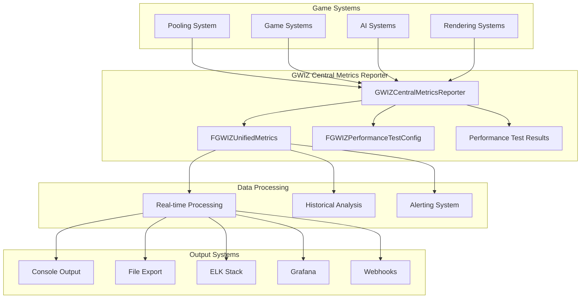
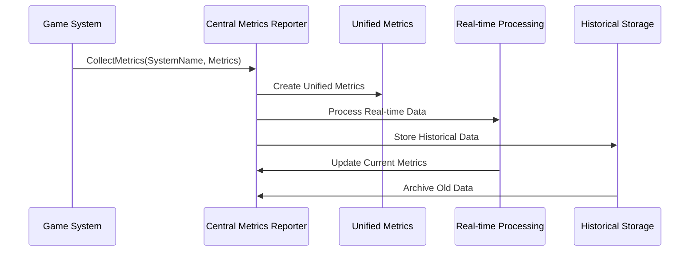
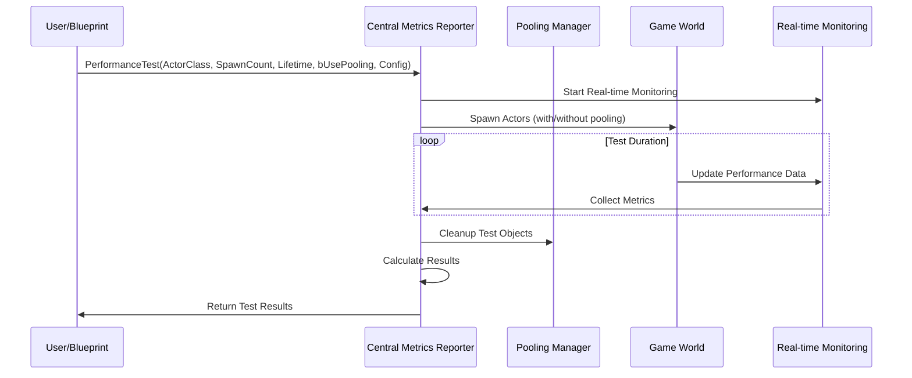
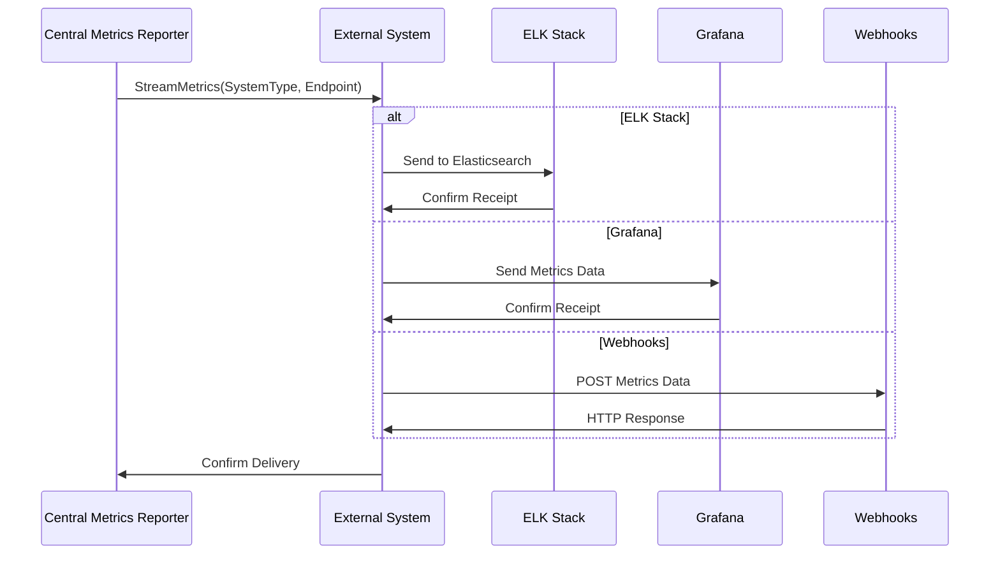

# GWIZ Central Metrics Reporter - Technical Design

## Overview

The GWIZ Central Metrics Reporter is a comprehensive metrics collection and reporting system designed to provide unified monitoring capabilities across all game systems. It serves as a centralized hub for collecting, processing, and exporting performance data, system statistics, and operational metrics.

## Architecture Overview



## Core Components

### 1. GWIZCentralMetricsReporter Class

```cpp
UCLASS(BlueprintType, Blueprintable)
class PLANETDEFENDER_API UGWIZCentralMetricsReporter : public UObject
{
    GENERATED_BODY()
    
public:
    // Singleton access
    UFUNCTION(BlueprintCallable, BlueprintPure, Category = "GWIZ Metrics")
    static UGWIZCentralMetricsReporter* GetMetricsReporter();
    
    // Performance testing
    UFUNCTION(BlueprintCallable, Category = "GWIZ Metrics")
    void PerformanceTest(TSubclassOf<AActor> ActorClass, int32 SpawnCount, 
                        float Lifetime, bool bUsePooling, 
                        const FGWIZPerformanceTestConfig& Config);
    
    // Metrics collection
    UFUNCTION(BlueprintCallable, Category = "GWIZ Metrics")
    void CollectMetrics(const FString& SystemName, const FGWIZUnifiedMetrics& Metrics);
    
    // Reporting functions
    UFUNCTION(BlueprintCallable, Category = "GWIZ Metrics")
    void PrintMetricsReport(const FString& SystemName = TEXT(""));
    
    UFUNCTION(BlueprintCallable, Category = "GWIZ Metrics")
    void ExportMetricsToFile(const FString& FilePath, const FString& Format = TEXT("JSON"));
    
    UFUNCTION(BlueprintCallable, Category = "GWIZ Metrics")
    void StreamMetricsToExternalSystem(const FString& SystemType, const FString& Endpoint);
    
    // Configuration
    UPROPERTY(EditAnywhere, BlueprintReadWrite, Category = "GWIZ Metrics")
    bool bEnableRealTimeMonitoring = true;
    
    UPROPERTY(EditAnywhere, BlueprintReadWrite, Category = "GWIZ Metrics")
    bool bEnableHistoricalData = true;
    
    UPROPERTY(EditAnywhere, BlueprintReadWrite, Category = "GWIZ Metrics")
    bool bEnableExternalStreaming = false;
    
    UPROPERTY(EditAnywhere, BlueprintReadWrite, Category = "GWIZ Metrics")
    float MetricsCollectionInterval = 1.0f;
    
    UPROPERTY(EditAnywhere, BlueprintReadWrite, Category = "GWIZ Metrics")
    int32 MaxHistoricalEntries = 1000;
    
protected:
    virtual void BeginDestroy() override;
    
private:
    // Metrics storage
    UPROPERTY()
    TMap<FString, FGWIZUnifiedMetrics> SystemMetrics;
    
    UPROPERTY()
    TArray<FGWIZUnifiedMetrics> HistoricalMetrics;
    
    // Performance test data
    UPROPERTY()
    TArray<FGWIZPerformanceTestResult> PerformanceTestResults;
    
    // Thread safety
    FCriticalSection MetricsMutex;
    
    // Timers
    FTimerHandle MetricsCollectionTimer;
    FTimerHandle HistoricalCleanupTimer;
    
    // External system connections
    TMap<FString, FGWIZExternalSystemConfig> ExternalSystems;
};
```

### 2. FGWIZUnifiedMetrics Structure

```cpp
USTRUCT(BlueprintType)
struct PLANETDEFENDER_API FGWIZUnifiedMetrics
{
    GENERATED_BODY()
    
public:
    FGWIZUnifiedMetrics()
        : Timestamp(0.0f)
        , SystemName(TEXT(""))
        , MetricType(EGWIZMetricType::Performance)
        , Value(0.0f)
        , Count(0)
        , MemoryUsage(0)
        , CPUUsage(0.0f)
        , GPUUsage(0.0f)
        , FrameTime(0.0f)
        , CustomData()
    {
    }
    
    // Basic identification
    UPROPERTY(BlueprintReadOnly, Category = "GWIZ Metrics")
    float Timestamp;
    
    UPROPERTY(BlueprintReadOnly, Category = "GWIZ Metrics")
    FString SystemName;
    
    UPROPERTY(BlueprintReadOnly, Category = "GWIZ Metrics")
    EGWIZMetricType MetricType;
    
    // Core metrics
    UPROPERTY(BlueprintReadOnly, Category = "GWIZ Metrics")
    float Value;
    
    UPROPERTY(BlueprintReadOnly, Category = "GWIZ Metrics")
    int32 Count;
    
    UPROPERTY(BlueprintReadOnly, Category = "GWIZ Metrics")
    int64 MemoryUsage;
    
    UPROPERTY(BlueprintReadOnly, Category = "GWIZ Metrics")
    float CPUUsage;
    
    UPROPERTY(BlueprintReadOnly, Category = "GWIZ Metrics")
    float GPUUsage;
    
    UPROPERTY(BlueprintReadOnly, Category = "GWIZ Metrics")
    float FrameTime;
    
    // Custom data for extensibility
    UPROPERTY(BlueprintReadOnly, Category = "GWIZ Metrics")
    TMap<FString, FString> CustomData;
    
    // Utility functions
    UFUNCTION(BlueprintCallable, Category = "GWIZ Metrics")
    FString ToJSON() const;
    
    UFUNCTION(BlueprintCallable, Category = "GWIZ Metrics")
    FString ToCSV() const;
    
    UFUNCTION(BlueprintCallable, Category = "GWIZ Metrics")
    void AddCustomData(const FString& Key, const FString& Value);
};
```

### 3. FGWIZPerformanceTestConfig Structure

```cpp
USTRUCT(BlueprintType)
struct PLANETDEFENDER_API FGWIZPerformanceTestConfig
{
    GENERATED_BODY()
    
public:
    FGWIZPerformanceTestConfig()
        : TestDuration(30.0f)
        , SpawnInterval(0.1f)
        , MeasurementInterval(0.5f)
        , bEnableMemoryTracking(true)
        , bEnableCPUTracking(true)
        , bEnableGPUTracking(false)
        , bEnableGarbageCollectionTracking(true)
        , bRunMultipleTests(false)
        , NumberOfTestRuns(3)
        , bCalculateAverages(true)
        , bGenerateReport(true)
        , ReportFormat(EGWIZReportFormat::JSON)
    {
    }
    
    // Test timing
    UPROPERTY(EditAnywhere, BlueprintReadWrite, Category = "Performance Test")
    float TestDuration;
    
    UPROPERTY(EditAnywhere, BlueprintReadWrite, Category = "Performance Test")
    float SpawnInterval;
    
    UPROPERTY(EditAnywhere, BlueprintReadWrite, Category = "Performance Test")
    float MeasurementInterval;
    
    // Tracking options
    UPROPERTY(EditAnywhere, BlueprintReadWrite, Category = "Performance Test")
    bool bEnableMemoryTracking;
    
    UPROPERTY(EditAnywhere, BlueprintReadWrite, Category = "Performance Test")
    bool bEnableCPUTracking;
    
    UPROPERTY(EditAnywhere, BlueprintReadWrite, Category = "Performance Test")
    bool bEnableGPUTracking;
    
    UPROPERTY(EditAnywhere, BlueprintReadWrite, Category = "Performance Test")
    bool bEnableGarbageCollectionTracking;
    
    // Test execution
    UPROPERTY(EditAnywhere, BlueprintReadWrite, Category = "Performance Test")
    bool bRunMultipleTests;
    
    UPROPERTY(EditAnywhere, BlueprintReadWrite, Category = "Performance Test")
    int32 NumberOfTestRuns;
    
    UPROPERTY(EditAnywhere, BlueprintReadWrite, Category = "Performance Test")
    bool bCalculateAverages;
    
    // Reporting
    UPROPERTY(EditAnywhere, BlueprintReadWrite, Category = "Performance Test")
    bool bGenerateReport;
    
    UPROPERTY(EditAnywhere, BlueprintReadWrite, Category = "Performance Test")
    EGWIZReportFormat ReportFormat;
};
```

### 4. FGWIZPerformanceTestResult Structure

```cpp
USTRUCT(BlueprintType)
struct PLANETDEFENDER_API FGWIZPerformanceTestResult
{
    GENERATED_BODY()
    
public:
    FGWIZPerformanceTestResult()
        : TestStartTime(0.0f)
        , TestEndTime(0.0f)
        , ActorClass(nullptr)
        , SpawnCount(0)
        , Lifetime(0.0f)
        , bUsedPooling(false)
        , AverageFrameTime(0.0f)
        , PeakFrameTime(0.0f)
        , AverageMemoryUsage(0)
        , PeakMemoryUsage(0)
        , AverageCPUUsage(0.0f)
        , PeakCPUUsage(0.0f)
        , GarbageCollectionCount(0)
        , PerformanceGain(0.0f)
        , TestConfig()
    {
    }
    
    // Test identification
    UPROPERTY(BlueprintReadOnly, Category = "Performance Test Result")
    float TestStartTime;
    
    UPROPERTY(BlueprintReadOnly, Category = "Performance Test Result")
    float TestEndTime;
    
    UPROPERTY(BlueprintReadOnly, Category = "Performance Test Result")
    TSubclassOf<AActor> ActorClass;
    
    UPROPERTY(BlueprintReadOnly, Category = "Performance Test Result")
    int32 SpawnCount;
    
    UPROPERTY(BlueprintReadOnly, Category = "Performance Test Result")
    float Lifetime;
    
    UPROPERTY(BlueprintReadOnly, Category = "Performance Test Result")
    bool bUsedPooling;
    
    // Performance metrics
    UPROPERTY(BlueprintReadOnly, Category = "Performance Test Result")
    float AverageFrameTime;
    
    UPROPERTY(BlueprintReadOnly, Category = "Performance Test Result")
    float PeakFrameTime;
    
    UPROPERTY(BlueprintReadOnly, Category = "Performance Test Result")
    int64 AverageMemoryUsage;
    
    UPROPERTY(BlueprintReadOnly, Category = "Performance Test Result")
    int64 PeakMemoryUsage;
    
    UPROPERTY(BlueprintReadOnly, Category = "Performance Test Result")
    float AverageCPUUsage;
    
    UPROPERTY(BlueprintReadOnly, Category = "Performance Test Result")
    float PeakCPUUsage;
    
    UPROPERTY(BlueprintReadOnly, Category = "Performance Test Result")
    int32 GarbageCollectionCount;
    
    UPROPERTY(BlueprintReadOnly, Category = "Performance Test Result")
    float PerformanceGain;
    
    // Configuration used
    UPROPERTY(BlueprintReadOnly, Category = "Performance Test Result")
    FGWIZPerformanceTestConfig TestConfig;
    
    // Utility functions
    UFUNCTION(BlueprintCallable, Category = "Performance Test Result")
    FString GenerateReport() const;
    
    UFUNCTION(BlueprintCallable, Category = "Performance Test Result")
    float GetTestDuration() const { return TestEndTime - TestStartTime; }
};
```

## Enums and Supporting Types

### EGWIZMetricType Enum

```cpp
UENUM(BlueprintType)
enum class EGWIZMetricType : uint8
{
    Performance UMETA(DisplayName = "Performance"),
    Memory UMETA(DisplayName = "Memory"),
    System UMETA(DisplayName = "System"),
    Custom UMETA(DisplayName = "Custom")
};
```

### EGWIZReportFormat Enum

```cpp
UENUM(BlueprintType)
enum class EGWIZReportFormat : uint8
{
    JSON UMETA(DisplayName = "JSON"),
    CSV UMETA(DisplayName = "CSV"),
    XML UMETA(DisplayName = "XML"),
    Text UMETA(DisplayName = "Text")
};
```

## Data Flow

### 1. Metrics Collection Flow



### 2. Performance Test Flow



### 3. External System Integration Flow



## Integration with Existing Systems

### Pooling System Integration

The Central Metrics Reporter integrates with the existing GWIZ Pooling System by:

1. **Replacing existing debug output**: `PrintDebugInfo()` and `PrintAllPoolStatistics()` now use the centralized reporter
2. **Enhanced metrics collection**: Pooling statistics are collected as unified metrics
3. **Performance testing**: Direct integration with pooling system for comparison testing
4. **Real-time monitoring**: Live pooling system metrics in the centralized dashboard

### Test Framework Integration

Integration with the existing test framework:

1. **Enhanced FSimplePoolingTests**: Performance benchmarks added to existing tests
2. **Automated testing**: Performance tests can be run as part of the test suite
3. **Result comparison**: Historical performance data for regression testing
4. **Continuous integration**: Performance metrics for CI/CD pipelines

## External System Support

### ELK Stack Integration

```cpp
// ELK Stack configuration
struct FGWIZELKConfig
{
    FString ElasticsearchEndpoint;
    FString IndexName;
    FString Username;
    FString Password;
    bool bUseSSL;
    float RetryInterval;
    int32 MaxRetries;
};
```

### Grafana Integration

```cpp
// Grafana configuration
struct FGWIZGrafanaConfig
{
    FString GrafanaEndpoint;
    FString APIKey;
    FString DashboardUID;
    FString PanelID;
    bool bUseInfluxDB;
    FString InfluxDBEndpoint;
};
```

### Webhook Support

```cpp
// Webhook configuration
struct FGWIZWebhookConfig
{
    FString WebhookURL;
    FString ContentType;
    TMap<FString, FString> Headers;
    float Timeout;
    bool bRetryOnFailure;
};
```

## Performance Considerations

### Memory Management

- **Efficient storage**: Historical data is stored in a ring buffer to prevent memory bloat
- **Configurable limits**: Maximum historical entries can be configured
- **Automatic cleanup**: Old data is automatically removed based on configuration
- **Memory pooling**: Reuse of metric structures to reduce allocations

### Thread Safety

- **Critical sections**: All shared data access is protected by mutexes
- **Lock-free operations**: Where possible, use atomic operations for better performance
- **Async processing**: Heavy operations are performed asynchronously
- **Batch processing**: Multiple metrics are processed in batches to reduce overhead

### Real-time Performance

- **Minimal overhead**: Metrics collection has minimal impact on game performance
- **Configurable intervals**: Collection frequency can be adjusted based on needs
- **Efficient data structures**: Optimized data structures for fast access and modification
- **Background processing**: Heavy analysis is performed in background threads

## Blueprint Integration

### Available Blueprint Functions

- **Get Metrics Reporter**: Access the singleton instance
- **Performance Test**: Run performance tests with full configuration
- **Collect Metrics**: Add metrics from any system
- **Print Report**: Generate and display metrics reports
- **Export Data**: Export metrics to various formats
- **Stream to External**: Send data to external monitoring systems

### Blueprint Events

- **On Metrics Updated**: Fired when new metrics are collected
- **On Performance Test Complete**: Fired when performance tests finish
- **On Alert Triggered**: Fired when performance thresholds are exceeded
- **On External System Connected**: Fired when external systems are successfully connected

## Configuration and Setup

### Default Configuration

The system comes with sensible defaults that can be overridden:

```cpp
// Default configuration
UGWIZCentralMetricsReporter::UGWIZCentralMetricsReporter()
{
    bEnableRealTimeMonitoring = true;
    bEnableHistoricalData = true;
    bEnableExternalStreaming = false;
    MetricsCollectionInterval = 1.0f;
    MaxHistoricalEntries = 1000;
}
```

### Runtime Configuration

Configuration can be changed at runtime through Blueprint or C++:

```cpp
// Runtime configuration example
UGWIZCentralMetricsReporter* Reporter = UGWIZCentralMetricsReporter::GetMetricsReporter();
Reporter->bEnableRealTimeMonitoring = true;
Reporter->MetricsCollectionInterval = 0.5f;
Reporter->MaxHistoricalEntries = 500;
```

## Future Extensibility

### Plugin Architecture

The system is designed for easy extension:

1. **Custom metric types**: New metric types can be added through the enum system
2. **External system plugins**: New external systems can be added through the plugin architecture
3. **Custom report formats**: New output formats can be implemented
4. **Advanced analytics**: Machine learning and predictive analytics can be added

### API Stability

The core API is designed to remain stable while allowing for extensions:

1. **Backward compatibility**: Existing code will continue to work
2. **Versioned APIs**: New features are added without breaking existing functionality
3. **Deprecation warnings**: Old APIs are marked as deprecated before removal
4. **Migration guides**: Clear migration paths for API changes
