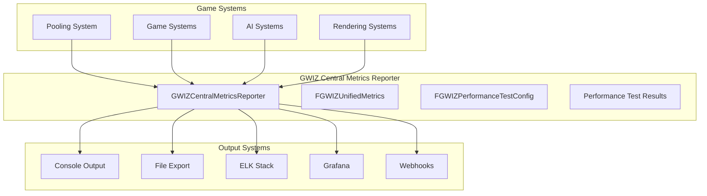

# GWIZ Central Metrics Reporter - Documentation

## Overview

The GWIZ Central Metrics Reporter is a comprehensive metrics collection and reporting system designed to provide unified monitoring capabilities across all game systems. It serves as a centralized hub for collecting, processing, and exporting performance data, system statistics, and operational metrics.

## Documentation Structure

### Core Documentation
- **[GWIZCentralMetricsReporter_Design.md](GWIZCentralMetricsReporter_Design.md)** - Complete technical design and architecture
- **[GWIZCentralMetricsReporter_Implementation_Plan.md](GWIZCentralMetricsReporter_Implementation_Plan.md)** - Detailed implementation plan and phases

### Integration Documentation
- **[Usage_Examples.md](Usage_Examples.md)** - Practical usage examples and tutorials
- **[Performance_Testing_Guide.md](Performance_Testing_Guide.md)** - Performance testing guide and examples
- **[API_Reference.md](API_Reference.md)** - Complete API documentation
- **[External_System_Integration.md](External_System_Integration.md)** - External system integration guide

## Key Features

### Core Capabilities
- **Unified Metrics Collection**: Single system for all performance and operational metrics
- **Performance Testing**: Automated performance testing with pooling vs non-pooling comparison
- **Real-time Monitoring**: Live performance monitoring and alerting
- **Historical Analysis**: Performance trend analysis and regression detection
- **External Integration**: Support for ELK Stack, Grafana, and other monitoring systems

### Integration Points
- **Pooling System**: Enhanced integration with GWIZ Pooling System
- **Test Framework**: Integration with existing test framework
- **Game Engine**: Leverages Unreal Engine's built-in capabilities
- **External Tools**: Data export for various monitoring and analysis tools

## Quick Start

### Basic Usage
```cpp
// Get the metrics reporter
UGWIZCentralMetricsReporter* Reporter = UGWIZCentralMetricsReporter::GetMetricsReporter();

// Collect metrics
FGWIZUnifiedMetrics Metrics;
Metrics.SystemName = TEXT("MySystem");
Metrics.Value = 42.0f;
Metrics.MemoryUsage = 1024 * 1024; // 1MB
Reporter->CollectMetrics(TEXT("MySystem"), Metrics);

// Run a performance test
FGWIZPerformanceTestConfig Config;
Config.TestDuration = 30.0f;
Config.SpawnInterval = 0.1f;
Reporter->PerformanceTest(AActor::StaticClass(), 100, 5.0f, true, Config);
```

### Blueprint Usage
1. Get the Metrics Reporter using "Get Metrics Reporter"
2. Use "Collect Metrics" to add metrics from your system
3. Use "Performance Test" to run performance benchmarks
4. Use "Print Metrics Report" to view current metrics
5. Use "Export Metrics To File" to save metrics data

## Architecture Overview



## Related Documentation

### Pooling System Integration
- **[Pooling System Requirements](../pooling-system/Pooling_System_Requirements.md)** - Updated with metrics requirements
- **[Pooling System Design](../pooling-system/Pooling_System_Design.md)** - Updated with metrics integration
- **[Pooling System Implementation Plan](../pooling-system/Pooling_System_Implementation_Plan.md)** - Updated with metrics implementation

### Project Documentation
- **[ToDo List](../pooling-system/ToDo.md)** - Updated with Phase 10 metrics implementation
- **[API Reference](../pooling-system/API.md)** - Pooling system API documentation
- **[Integration Guide](../pooling-system/Integration_Guide.md)** - Pooling system integration guide

## Implementation Status

### Completed
- ✅ **Phase 1-6**: Core pooling system implementation
- ✅ **Phase 7**: Documentation and examples
- ✅ **Phase 8**: Performance optimization

### In Progress
- 🔄 **Phase 10**: Performance testing and centralized metrics system

### Planned
- **Phase 9**: Optional plugin conversion
- **External System Integrations**: ELK Stack, Grafana, etc.

## Getting Help

### Documentation
- Check the [Design Document](GWIZCentralMetricsReporter_Design.md) for technical details
- Review the [Implementation Plan](GWIZCentralMetricsReporter_Implementation_Plan.md) for development phases
- See [Usage Examples](Usage_Examples.md) for practical examples

### Integration
- Review [External System Integration](External_System_Integration.md) for monitoring system setup
- Check [Performance Testing Guide](Performance_Testing_Guide.md) for benchmarking
- See [API Reference](API_Reference.md) for complete function documentation

### Troubleshooting
- Check the [Integration Guide](../pooling-system/Integration_Guide.md) for common issues
- Review the [Testing Guide](../pooling-system/testing.md) for validation steps
- See the [ToDo List](../pooling-system/ToDo.md) for current implementation status
